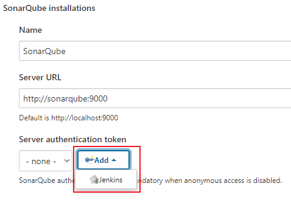

# 📊 Jenkins + SonarQube Code Analysis for Node.js

This guide walks you through setting up **Jenkins** and **SonarQube** using **Docker Compose** to run code analysis on a **Node.js** application.

> ✅ Local setup — no external services required.

---

## 🧰 Requirements

- [Docker](https://www.docker.com)
- Any Git repository (e.g. [MatheusIshiyama Repos](https://github.com/MatheusIshiyama?tab=repositories))

---

## 🐳 Jenkins & SonarQube with Docker Compose

Create a `docker-compose.yml` in an empty folder:

```yaml
version: '3'
services:
  sonarqube:
    image: sonarqube:lts
    ports:
      - 9000:9000
    networks:
      - mynetwork
  jenkins:
    image: jenkins/jenkins:lts
    ports:
      - 8080:8080
    networks:
      - mynetwork
networks:
  mynetwork:
```

Run with:

```bash
docker compose up
```

---

## 🔧 Jenkins Setup

### 1. Access Jenkins

- Go to `http://localhost:8080`
- Use the unlock token from your terminal output

<p align="center">
  
  <br>
  
</p>

### 2. Install Plugins

- Click **"Select plugins to install"**
- Click **"None"**, then search and select:

  - `git`
  - `pipeline`

<p align="center">
  
  <br>
  
  <br>
  
</p>

### 3. Finalize Setup

- Set Jenkins URL: `http://localhost:8080`

<p align="center">
  
</p>

---

## 🔐 SonarQube Setup

- Visit `http://localhost:9000`
- Login: `admin` | Password: `admin`
- Change password after first login

<p align="center">
  
  <br>
  
</p>

---

## 🔄 Add SonarQube to Jenkins

### 1. Install Plugins

- Go to **Manage Jenkins > Manage Plugins > Available**
- Install:

  - `SonarQube Scanner`
  - `NodeJS Plugin`

<p align="center">
  
  <br>
  
  <br>
  
  <br>
  
  <br>
  
  <br>
  
</p>

### 2. Configure SonarQube

- **Manage Jenkins > Configure System**
- Scroll to **SonarQube Servers**
- Add name: `SonarQube`, URL: `http://sonarqube:9000`

<p align="center">
  
  <br>
  
</p>

### 3. Setup Tools

- **Manage Jenkins > Global Tool Configuration**
- Add:

  - SonarQube Scanner (`SonarQubeScanner`)
  - Node.js (`NodeJs`)

<p align="center">
  
  <br>
  
  <br>
  
  <br>
  
  <br>
  
  <br>
  
</p>

---

## ↔️ Add Jenkins to SonarQube

- In SonarQube go to: **Administration > Configuration > Webhooks**
- Create a webhook:

  - Name: `Jenkins`
  - URL: `http://jenkins:8080/sonarqube-webhook/`

<p align="center">
  
  <br>
  
  <br>
  
  <br>
  
</p>

---

## ⚙️ Add `sonar-project.properties`

In your Node.js app root:

```properties
sonar.projectKey=your-application
sonar.projectName=Your Application
sonar.sources=.
sonar.sourceEncoding=UTF-8
sonar.scm.disabled=true
```

---

## 🛠️ Create a Jenkins Job

### 1. New Job

- Click **New Item** → Name it → Select **Pipeline** → OK

<p align="center">
  
  <br>
  
</p>

### 2. Pipeline Script

Paste the following:

```groovy
pipeline {
  agent any

  tools { nodejs "NodeJs" }

  stages {
    stage('Clone sources') {
      steps {
        git branch: 'main', url: 'https://github.com/MatheusIshiyama/BravanzinBot.git'
      }
    }

    stage('SonarQube analysis') {
      environment {
        SCANNER_HOME = tool 'SonarQubeScanner'
      }
      steps {
        withSonarQubeEnv('SonarQube') {
          sh "${SCANNER_HOME}/bin/sonar-scanner"
        }
      }
    }
  }
}
```

Click **Save**, then **Build Now**.

<p align="center">
  
  <br>
  
</p>

---

## 🔑 SonarQube Token for Jenkins

### 1. Generate Token in SonarQube

- Go to your profile → **My Account > Security**
- Create token (e.g. name: `sonarqube-token`)

<p align="center">
  
  <br>
  
  <br>
  
  <br>
  
</p>

### 2. Add Token in Jenkins

- **Manage Jenkins > Configure System**
- In **SonarQube Servers**, click `Add` under Authentication
- Select `Secret text` → paste token → set ID (e.g. `sonarqube-token`)
- Choose that ID in **Server authentication token**

<p align="center">
  
  <br>
  
  <br>
  
  <br>
  
</p>

---

✅ Your Jenkins pipeline now integrates with SonarQube to analyze your Node.js code!
